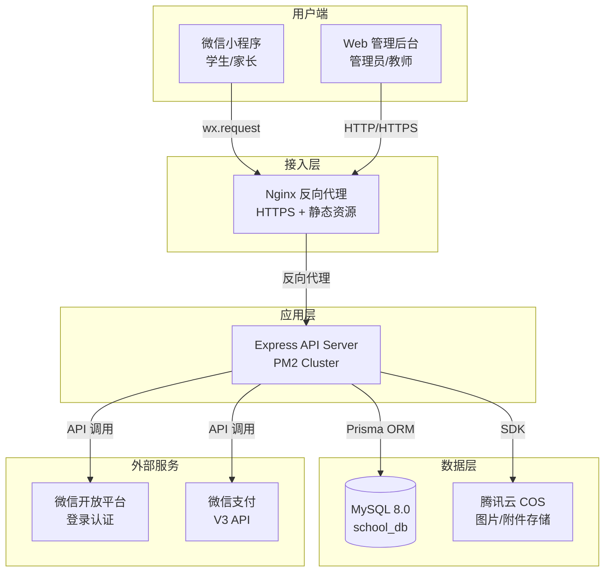
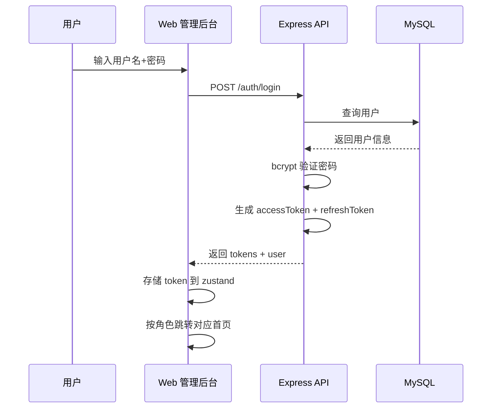
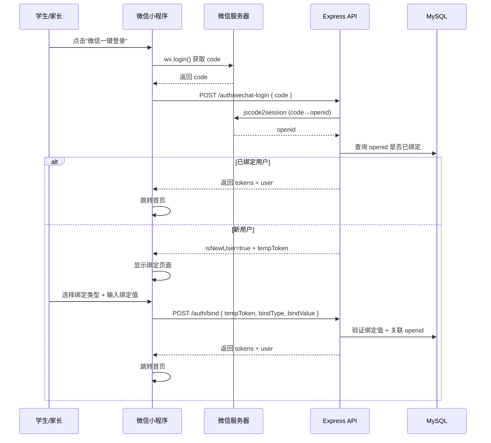
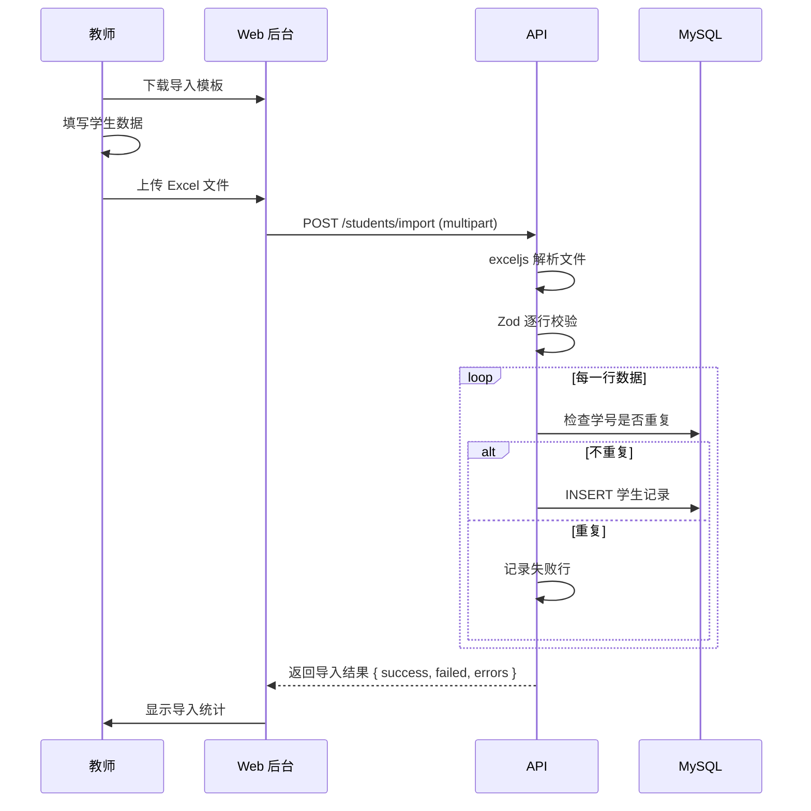
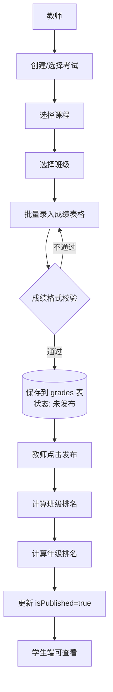
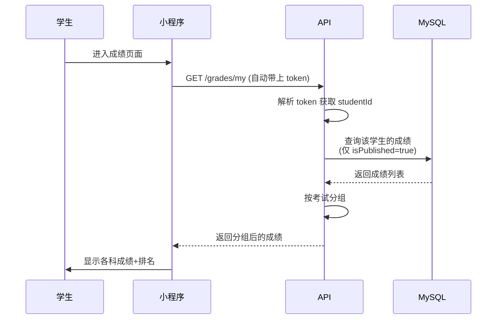
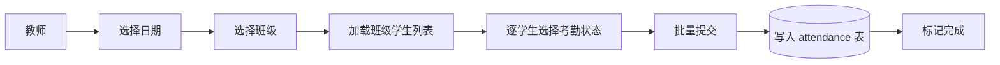
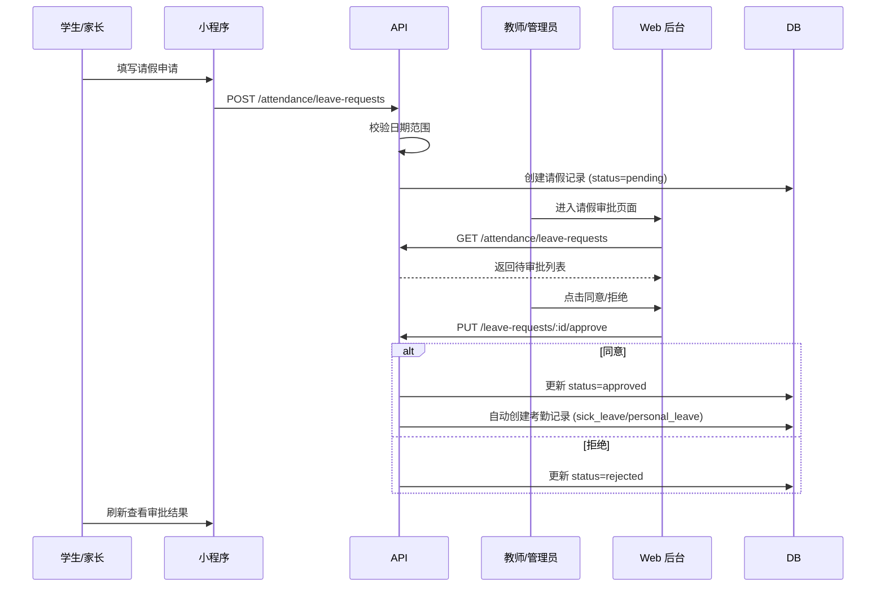
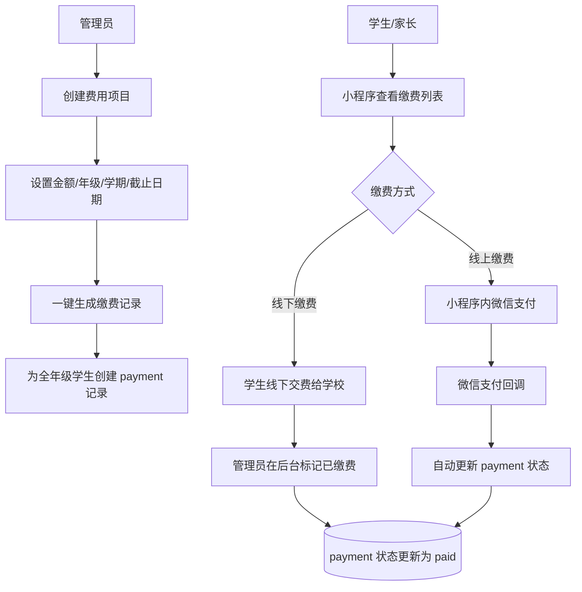
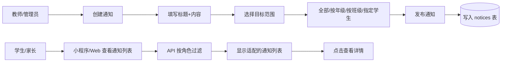

# 中学学生管理系统 — 业务流程图

## 1. 系统整体架构



## 2. 用户认证流程

### 2.1 Web 管理后台登录



### 2.2 微信小程序登录



## 3. 学生管理流程

### 3.1 学生信息维护

```mermaid
flowchart LR
    A[管理员/教师登录] --> B{操作类型}
    B -->|新增| C[填写学生信息表单]
    B -->|编辑| D[搜索/筛选学生]
    B -->|删除| D
    B -->|导入| E[上传 Excel 文件]

    C --> C1[上传照片 (可选)]
    C1 --> C2[提交创建]
    C2 --> C3[(数据库写入)]

    D --> D1[选择目标学生]
    D1 --> D2{操作}
    D2 -->|编辑| D3[修改信息 → 保存]
    D2 -->|删除| D4[软删除 (deletedAt)]

    E --> E1[服务端校验]
    E1 --> E2{校验结果}
    E2 -->|通过| E3[逐行写入]
    E2 -->|失败| E4[返回错误明细]
```

### 3.2 Excel 批量导入流程



## 4. 成绩管理流程

### 4.1 成绩录入 → 发布流程



### 4.2 学生查成绩流程



## 5. 考勤与请假流程

### 5.1 考勤标记流程



### 5.2 请假申请与审批流程



## 6. 费用管理流程



## 7. 通知公告流程



## 8. 宿舍分配流程

```mermaid
flowchart TD
    A[管理员] --> B[创建宿舍楼]
    B --> C[设置名称/类型(男女)/楼层数]
    C --> D[创建房间]
    D --> E[设置房间号/所属楼栋/容量]

    F[分配学生] --> G[选择房间]
    G --> H[点击"添加学生"]
    H --> I[选择班级]
    I --> J[级联选择学生]
    J --> K{检查容量}
    K -->|已满| L[提示容量不足]
    K -->|有余量| M[提交分配]
    M --> N[(更新 dormitory_rooms.occupied<br/>+ 学生 dormitoryId)]
```
